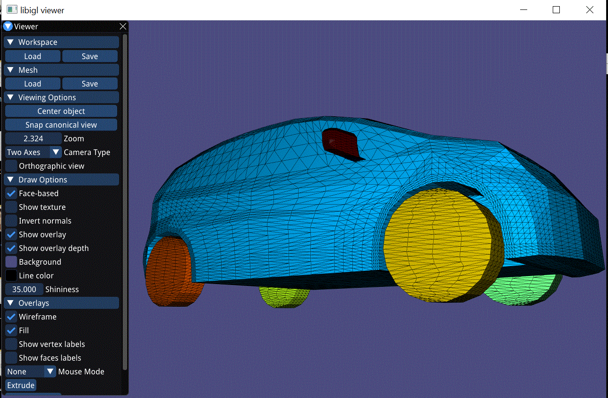
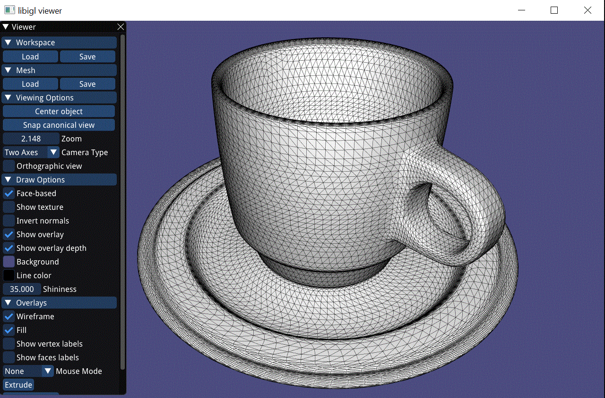
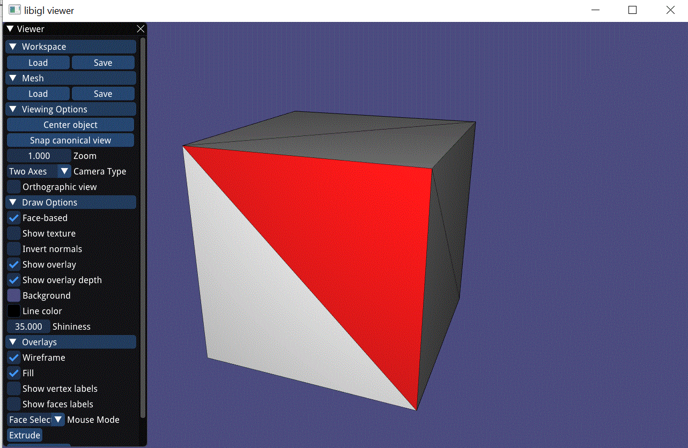
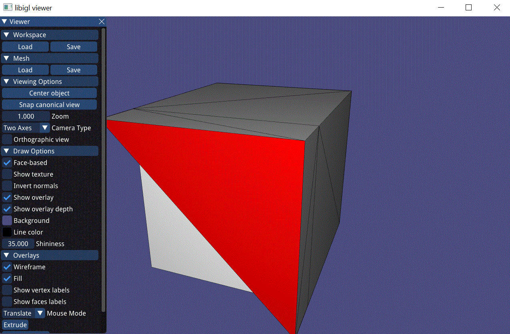

# Shape Modeling and Geometry Processing

## Notes
1. Part of the course "Geometric Processing, 203.3747", Haifa University, Israel
2. The program allows the user to perform different geometric processings on models (shown below)

## Technology & Tools
1. Written in C++, using OpenGL libraries (GLAD and GLFW) and Imgui for UI
2. Uses math libraries: Eigen

## Geometric Processings:

#### Parts Detection 

#### Remeshing 

#### Extrudion 

#### Face Recosntruction 

