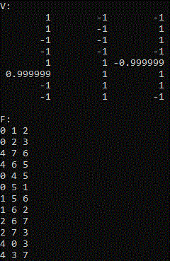
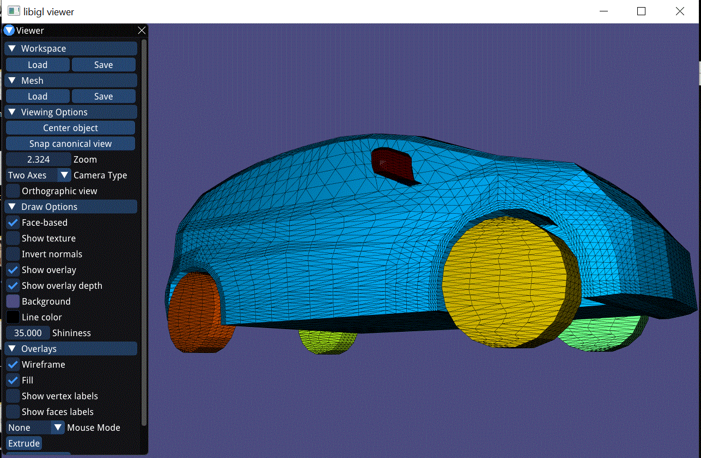
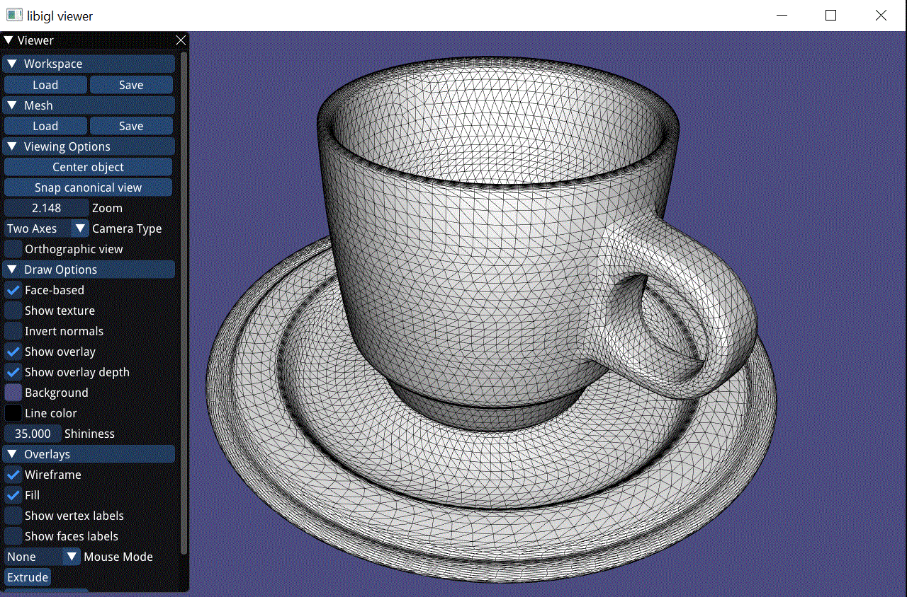

# Assignment 1

Edit this 'README.md' file to report all your results. There is no need to write lengthy reports, just show the requested outputs and screenshots and quickly summarize your observations.   

## Required results

### Tasks
1) Add a text dump of the content of the two data structures for the provided mesh “cube.off”.

#### For a given Cube: 

#### Adjacency list of Vertex-To-Faces: 

#### Adjacency list of Vertex-To-Vertex: 

2) Show screenshots of the provided meshes with each connected component colored differently. Show the number of connected components and the size of each component (measured in number of faces) for all the provided models.

#### Cube: 

#### Cup: 

#### Honda: 

3) Show screenshots of the subdivided meshes.

#### Cube: 

#### Cup: 

#### Honda: 

4) Show screenshots of face extrusion.

5) Show a screenshot of a mesh you designed yourself starting from 'cube.off' and using the GUI supplied editing operations, as well as sqrt3 subdivision and face extrusion. Make sure to also save the mesh under the name 'design.off', commit and push it. 
