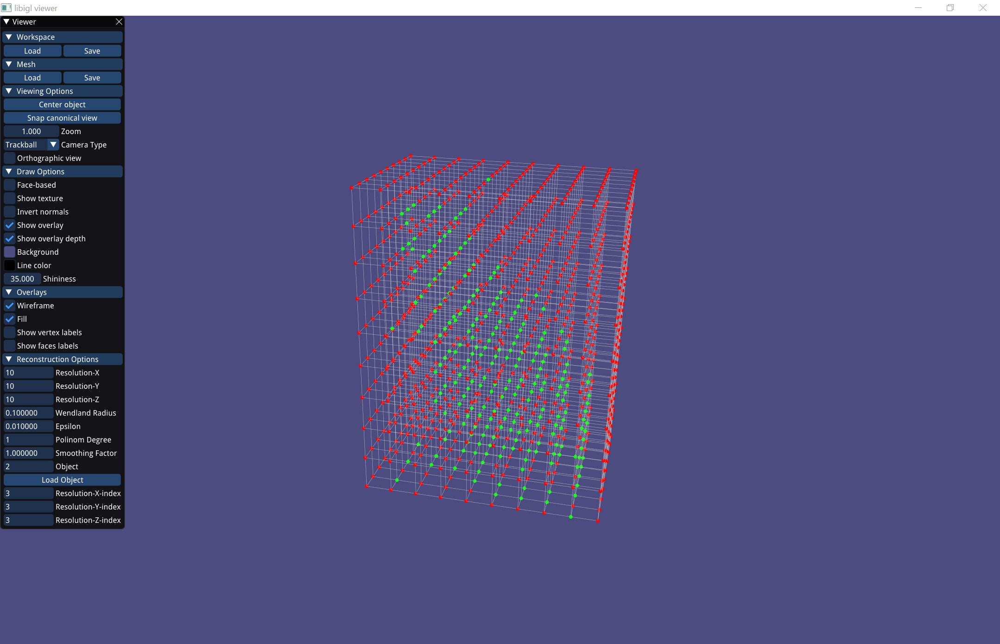
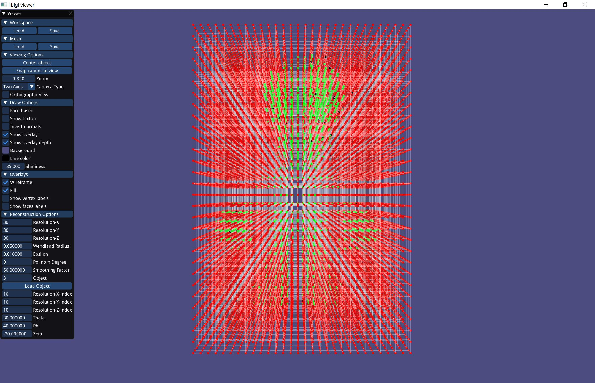

# Assignment 2

Edit this 'README.md' file to report all your results. There is no need to write lengthy reports, just show the requested outputs and screenshots and quickly summarize your observations. Please add your additional files or notes in the folder 'assignment2/results' and refer to or directly show them in this page.

## Required results

### Mandatory Tasks
1) Show the visualization of the constrained points for the 'cat.off' point cloud.

#### Cat: 

2) Show screenshots of the grid with nodes colored according to their implicit function values (cat.off and luigi.off).

#### Cat: 

#### Luigi: 

3) Show screenshots of the reconstructed surfaces. Experiment with different parameter settings: grid resolution (also anisotropic in the 3 axes), Wendland function radius, polynomial degree. Add all these settings to the GUI to ease experimentation. Briefly summarize your observations and save the reconstructed models in the off format for every point-cloud dataset provided (assignment2/results).

#### Sphere: 
##### Parameters: Res_15_WR_0.1_Epsilon_0.01_PD_1_SF_Unset  

##### Parameters: Res_15_WR_0.1_Epsilon_0.01_PD_1_SF_1  

#### Cat: 
##### Parameters: Res_20_WR_0.1_Epsilon_0.01_PD_2_SF_150  

##### Parameters: Res_20_WR_0.1_Epsilon_0.01_PD_1_SF_150  

##### Parameters: Res_20_WR_0.1_Epsilon_0.01_PD_0_SF_300  

##### Parameters: Res_20_WR_0.1_Epsilon_0.01_PD_0_SF_150  

##### Parameters: Res_30_WR_0.1_Epsilon_0.01_PD_0_SF_150  

##### Parameters: Res_40_WR_0.1_Epsilon_0.01_PD_0_SF_150  

##### Parameters: Res_50_WR_0.1_Epsilon_0.01_PD_0_SF_150  

#### Luigi: 
##### Parameters: Res_30_WR_0.05_Epsilon_0.01_PD_0_SF_10  

##### Parameters: Res_40_WR_0.05_Epsilon_0.01_PD_0_SF_10  

#### Conclusions: 
##### 1. As it can be seen, from the Sphere, increasing the Smoothing Factor from 0.35 to 1 has improved significantly the quality but as be seen, from the Cat, to high Smoothing Factor is also bad  
##### 2. As expected, from the Cat, increasing the Resolution from 20 to 50 has improved significantly the quality, using high resolution is possible only because of the Spatial Index  
##### 3. As surprising it is, from the Cat, Polinom Degree of 0 is bather than 1 and 2 since it leaves a lot of artifacts and cats the ears of the cat  

4) Theory question: Save your notes to assignment2/results and add a link to this page.
##### Answer can be found here

### Optional Tasks

1) Save your notes and add a link to this page.

2) Show screenshots comparing the 'hound.off' of the normal based reconstruction to the point based reconstruction of the mandatory task.

3) Compare your MLS reconstruction results to the surfaces obtained with this method, and try to understand the differences. Report your findings.
