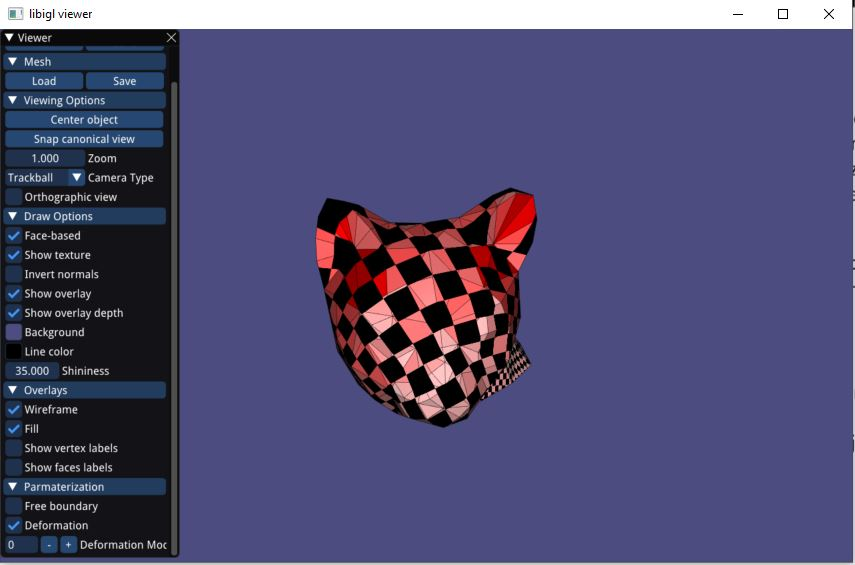
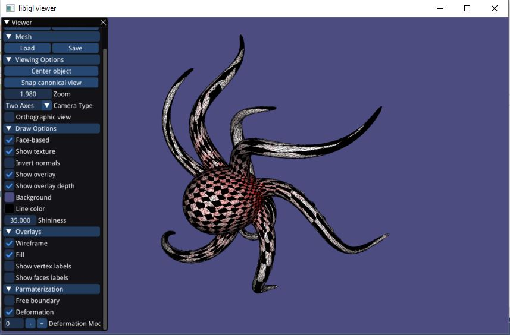

# Assignment 3

Edit this 'README.md' file to report all your results. There is no need to write lengthy reports, just show the requested outputs and screenshots and quickly summarize your observations. Please add your additional files or notes in the folder 'assignment3/results' and refer to or directly show them in this page.

## Required results

* Screenshots of the parameterizations and textured (checkerboard) models for all the implemented methods and boundary conditions (models: cathead.obj, hemisphere.off, hemisphere_non_convex_boundary.off,Octo_cut2.obj)
* Several examples of the distortion visualizations.

#### CatHead: 
##### Uniform Laplacian  

##### Contangent Laplacian  

##### LSCM  

#### HemiSphere: 
##### Uniform Laplacian  

##### Contangent Laplacian  

#### Octo: 
##### Uniform Laplacian  

##### Contangent Laplacian  

#### NonConvex: 
##### Uniform Laplacian  

##### Contangent Laplacian  

#### Notes: 
##### 1. I haven't implemented the free boudnry conditions  
##### 2. Since Contangent Laplacian and LSCM give the same result for boundry conditions, i have taken images of LSCM only for the first object - CatHead  
##### 3. As deformation index i have measured the edge length preservaation   
