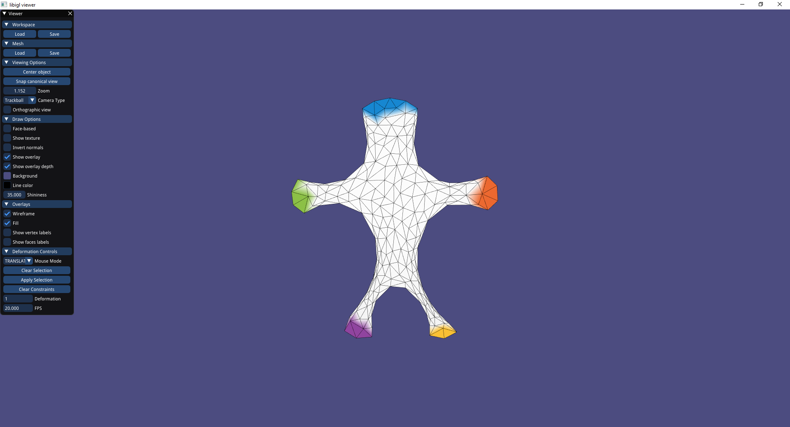
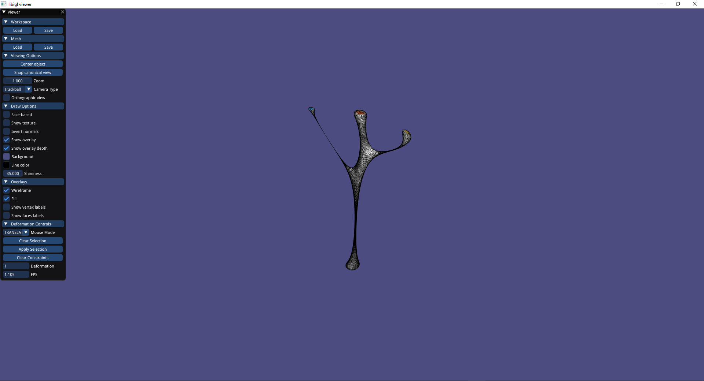

# Assignment 4

Edit this 'README.md' file to report all your results. There is no need to write lengthy reports, just show the requested outputs and screenshots and quickly summarize your observations. Please add your additional files or notes in the folder 'assignment4/results' and refer to or directly show them in this page.

## Required results for assignment 4

### Mandatory Tasks

Provide screenshots for 4 different deformed meshes. For each example, provide a rendering of S, B, B' and S'.

#### Woody 
##### S 

##### B 

##### B' 

##### S' 

#### Bar 
##### S 

##### B 

##### B' 

##### S' 

#### Cactus 
##### S 

##### B 

##### B' 

##### S' 

#### Hand 
##### S 

##### B 

##### B' 

##### S' 

#### Note: 
##### The PFS can be seen in the buttom of the controls bar 
##### For woody it is higher then 10 fps, but for bigger meshes, it is lower 
##### I did as it says in the tutorial presentation and assigment pdf, and moved the factorization to not run with solve but once the handles are fixed  

### Optional Task

Discuss and show the differences to the results from the previous task. 
