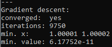
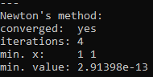
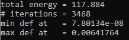
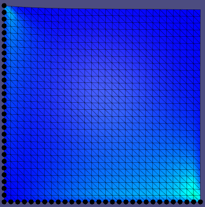
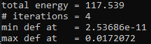
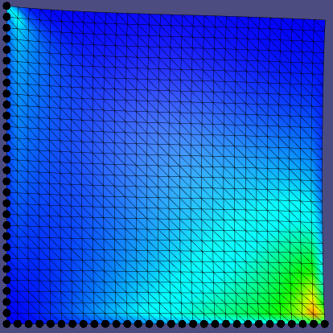

# Assignment 5

Edit this 'README.md' file to report all your results. There is no need to write lengthy reports, just show the requested outputs and screenshots and quickly summarize your observations.   

## Required results

#### 1.1 - Gradient Descent and Line Search 

#### 1.2 - Newton's method 

#### 2.1 - Gradient Descent and Line Search 

#### 2.2 - Newton's method 

